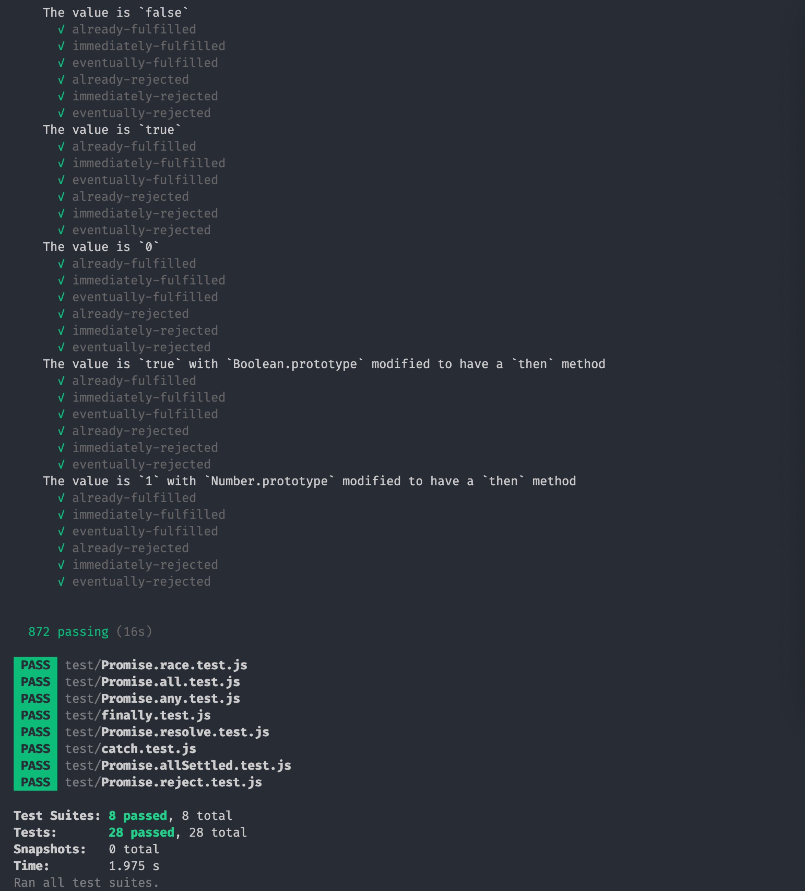

# Promise 实现

## 实现

根据 [Promises/A+ 标准](https://promisesaplus.com/) 实现的简单版 Promise，源码放置在 **source** 目录下

## 测试

通过 [Promises/A+ Compliance Test Suite](https://github.com/promises-aplus/promises-tests) 所有测试用例

其他的方法（finally, Promise.all, Promise.allSettled, Promise.any, Promise.race, Promise.reject, Promise.resolve）根据 [MDN Promise](https://developer.mozilla.org/zh-CN/docs/Web/JavaScript/Reference/Global_Objects/Promise) 上的介绍，使用 [jest](https://jestjs.io/en/) 写了一些简单的测试用例

---

通过 `npm run test` 执行测试用例，测试结果：

